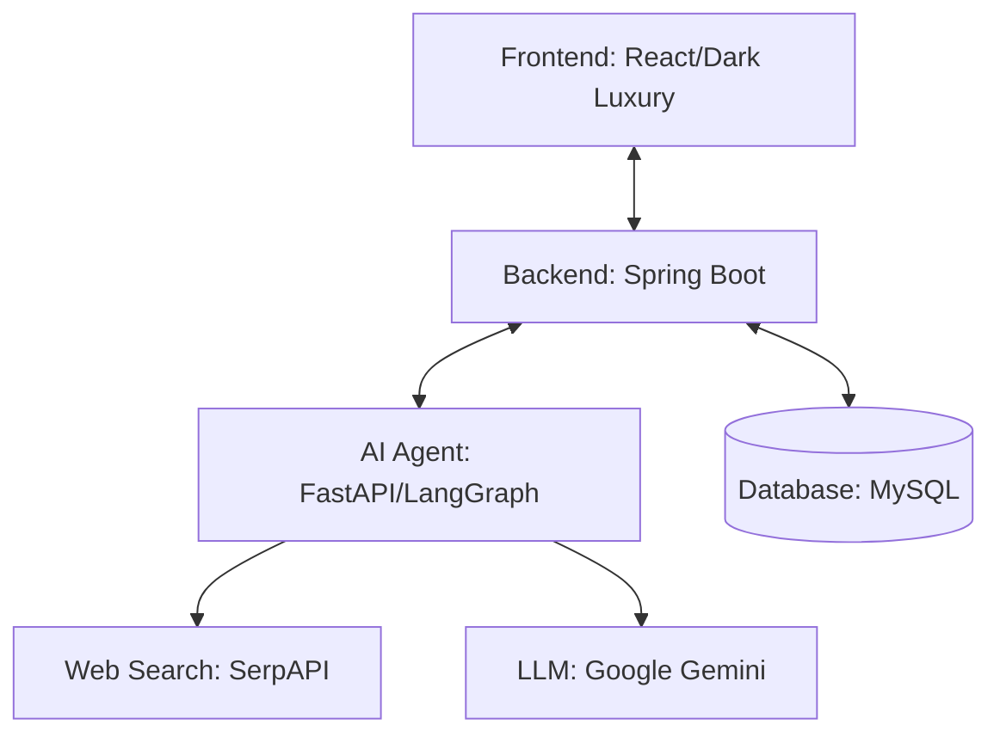
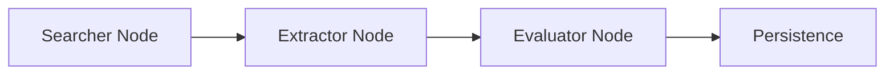

# 🚀 Agentic Career Matchmaker
[](https://jdk.java.net/17/)
[](https://www.python.org/)
[](https://reactjs.org/)
[](https://fastapi.tiangolo.com/)
[](https://opensource.org/licenses/MIT)

An end-to-end automated internship discovery and analysis platform. This system leverages **Agentic AI** to hunt for opportunities, scrape data, evaluate fit using LLMs, and present them in a high-end dashboard.

---

## 🌌 System Architecture

The project is built as a microservices-based ecosystem designed for scalability and intelligence.



### 🧠 The AI Brain (LangGraph)
The AI agent doesn't just search; it follows a sophisticated multi-step reasoning path:



1.  **Searcher**: Uses SerpAPI to locate relevant internship postings dynamically.
2.  **Extractor**: Parses raw web content into structured JSON.
3.  **Evaluator**: Uses Google Gemini to score the job based on requirements and salary.

---

## ✨ Features

- **Autonomous Discovery**: Scheduled scraping of the latest career opportunities.
- **AI Scoring**: Intelligent evaluation of roles to filter out irrelevant postings.
- **Dark Luxury UI**: A premium Dashboard built with React and Tailwind CSS, featuring Bento grids and smooth animations.
- **Robust Persistence**: Securely stores job intelligence in a structured database.

---

## 🚀 Installation & Setup

### ⚙️ Environment Configuration

You must create `.env` files in each of the three directories. Use the keys below:

| Service | Key | Description |
| :--- | :--- | :--- |
| **AI Agent** | `GOOGLE_API_KEY` | Gemini API Key |
| **AI Agent** | `SERPAPI_API_KEY` | Real-time Search Key |
| **Backend** | `DB_URL` | MySQL Connection String |
| **Backend** | `AGENT_SERVICE_URL` | AI Microservice Endpoint |

---

### Step 1: AI Microservice (Python)
```bash
cd ai-agent
python -v mvenv venv
source venv/bin/activate  # venv\Scripts\activate on Windows
pip install -r requirements.txt
python app/main.py
```

### Step 2: Core Backend (Java)
```bash
cd backend
./mvnw spring-boot:run
```

### Step 3: Premium Frontend (React)
```bash
cd frontend
npm install
npm run dev
```

---

## 🛠️ Tech Stack

- **AI Layer**: LangGraph, LangChain, Google Gemini Pro.
- **Backend**: Java 17, Spring Boot, Spring Data JPA, MySQL.
- **Frontend**: React 18, Vite, Tailwind CSS, Framer Motion.
- **Data**: SerpAPI (Google Search Engine Results).

---

## 📜 License
Integrated as part of the **Agentic Matchmaker Portfolio**. Released under the [MIT License](LICENSE).

> [!NOTE]
> This project was built by **Antigravity AI** as an advanced demonstration of autonomous web agents.
